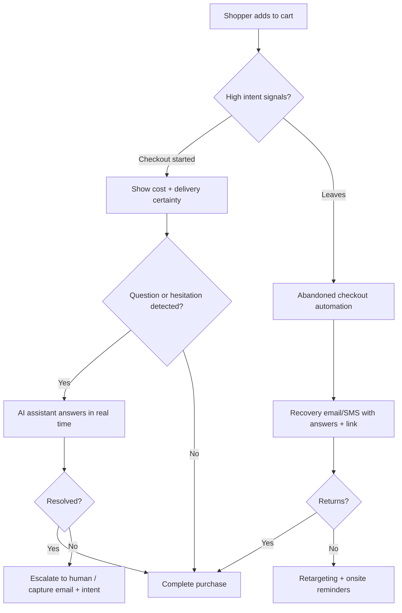
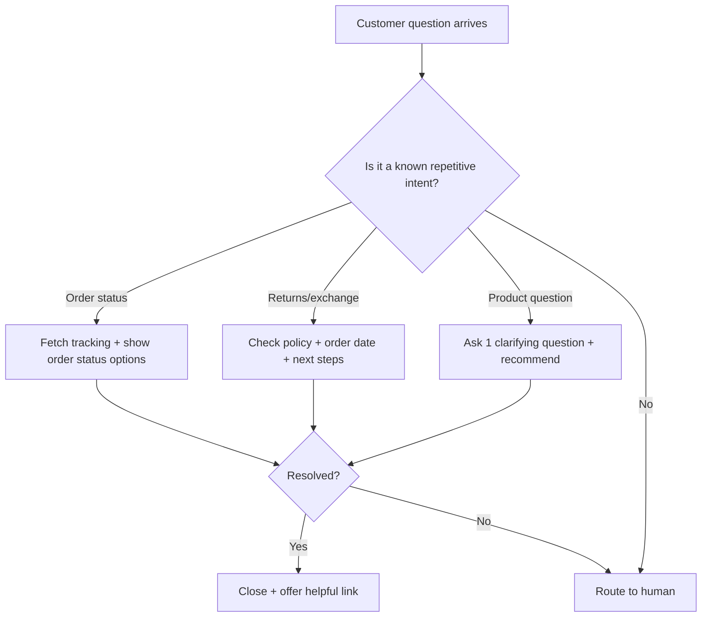

# Six Fully Researched, SEO-Optimized Blog Posts for Stores and AI Chatbots

## You Watch Sales Slip Away at Checkout

### Executive summary  
Checkout drop-off is rarely “random.” Industry research shows most abandonment happens because of cost surprises, delivery uncertainty, trust gaps, and friction (too many fields, forced account creation, payment limitations).citeturn10view3turn13view7turn10view2 This post gives a Shopify-specific playbook: eliminate surprise costs early, simplify checkout input, expand payment methods (including accelerated checkouts), and add real-time help plus abandoned-checkout recovery automation.citeturn9view2turn13view1turn9view1

### SEO metadata pack
**SEO title (≤60 chars):** Reduce Checkout Abandonment on Shopify  
**URL slug:** `/blog/reduce-checkout-abandonment-shopify`  
**Meta description (150–160 chars):** Fix checkout abandonment on Shopify with research-backed UX changes, faster payments, clearer shipping/returns, and automated recovery flows.

**Target keywords (primary + LSI):** checkout abandonment Shopify, cart abandonment rate, reduce checkout friction, Shop Pay conversion, guest checkout, checkout UX best practices, abandoned checkout emails, ecommerce checkout optimization, checkout form fields

**Internal link suggestions (placeholders):**
- “Checkout recovery automation” → `/features/abandoned-checkout-recovery`
- “Shop Pay and accelerated checkout support” → `/integrations/shop-pay`
- “Case study: checkout lift” → `/case-studies/checkout-conversion`
- “Pricing” → `/pricing`
- “AI sales assistant for checkout questions” → `/features/ai-assistant`

**Recommended on-page SEO elements**
- **Schema types:** `Article`, `FAQPage`, `HowTo`, `BreadcrumbList`
- **Recommended images (with alt text):**
  - Screenshot-style graphic of Shopify funnel report (or a recreated chart): **Alt:** “Checkout funnel showing cart, checkout, and purchase drop-off”
  - Diagram of “cost transparency” elements (shipping, tax, returns): **Alt:** “Example of transparent pricing before checkout”
  - Payment options strip including accelerated checkout: **Alt:** “Checkout payment options including accelerated checkout”

### Publish-ready blog post

**H1:** You Watch Sales Slip Away at Checkout

#### Intro  
You did everything “right.” The ads worked. People browsed. They added items to cart. Then, right at checkout—where intent is highest—your sales slip away. That’s not bad luck. It’s usually a solvable mismatch between *what the customer needs to feel confident* and *what the checkout experience gives them in that moment*.

Industry-wide, cart abandonment averages around **70%** (Baymard’s roll-up of dozens of studies).citeturn9view0 More importantly, the *reasons* are repeatable: customers leave when extra costs feel too high (39%), delivery feels too slow (21%), trust feels shaky (19%), they’re forced to create an account (19%), checkout is too long/complicated (18%), or policies and reliability aren’t clear.citeturn10view3

This guide focuses on Shopify-specific fixes that reduce friction, increase perceived fairness, and add “in-the-moment” support—without discounting your way into lower margins.

#### The problem  
When shoppers reach checkout, they’re trying to answer a final set of questions quickly:

- “Is the total price fair and predictable?”  
- “Will this arrive when I need it?”  
- “Is this store legit and the payment safe?”  
- “How much effort is left?”  

If checkout fails those tests, the default decision is to postpone or abandon.

#### The causes  
Checkout abandonment consistently clusters into a few root causes:

##### Cost surprises and perceived unfairness  
Extra costs are the #1 documented reason shoppers abandon at checkout.citeturn10view3 This is less about the *absolute* shipping/tax amount and more about the emotional experience of “I was misled.”

##### Delivery uncertainty  
Slow delivery (or unclear delivery timing) drives abandonment.citeturn10view3 The bigger issue is uncertainty: if customers can’t tell whether it arrives before a trip, event, or deadline, they bounce.

##### Trust gaps at the payment moment  
A meaningful share of shoppers abandon because they don’t trust the site with card information.citeturn10view3 Even on Shopify’s secure infrastructure, shoppers may not *feel* safe if trust cues are missing or inconsistent.

##### Forced account creation or poorly presented guest checkout  
Account creation is a documented abandonment driver.citeturn10view3turn13view7 If “guest checkout” is hidden, shoppers interpret it as forced registration.

##### Excessive checkout effort (fields, errors, complexity)  
Baymard’s checkout benchmark highlights that the average checkout (as measured in their research) contains **11.3 form fields**, and **18%** of users have abandoned due to checkout complexity.citeturn10view2 The key insight: not just “steps,” but the *effort* and error-proneness of field entry.

##### Payment method mismatch  
A non-trivial set of shoppers leave when there aren’t enough payment methods.citeturn10view3 This is especially painful on mobile, where wallets and accelerated checkouts reduce typing and trust friction.

#### The impact  
Checkout abandonment hurts more than conversion rate:

- It **raises your effective CAC** because you paid to acquire traffic that got “stuck” at the last mile.  
- It **distorts merchandising signals** (your top-of-funnel and PDP performance looks fine, revenue doesn’t match).  
- It **trains your team to over-discount**, because discounts feel like the fastest lever when the real issue is friction and trust.  
- It **worsens support load**, because unclear shipping/returns triggers pre-purchase and post-purchase tickets.

#### Detailed solutions  
Below is a Shopify-first checklist mapped to the biggest causes.

##### Remove cost surprises before checkout  
1) **Show shipping expectations early** (PDP/cart), not as a surprise at checkout.  
2) **Explain taxes/duties for cross-border orders** in plain language if you sell internationally.  
3) **Use a “total cost” mindset**: customers abandon when they can’t calculate the full cost upfront.citeturn10view3

Practical Shopify execution:
- Put shipping threshold messaging near the “Add to cart” and in the cart drawer.
- Add a short returns snippet (e.g., “30-day returns”) near the buy box and again in checkout messaging.

##### Make delivery feel predictable  
- Use **delivery date language** (e.g., “Arrives Tue–Thu”) rather than vague “fast shipping,” especially for gifts.  
- Clarify “processing time” vs “shipping time” on PDP and cart.  
- Add a simple “Need it by…” helper inside chat (more on this below).

##### Reduce checkout effort: fewer fields, fewer chances to fail  
Baymard’s research emphasizes that reducing form fields reduces perceived complexity and improves checkout UX.citeturn10view2

Tactics:
- Avoid splitting name fields unnecessarily (where possible in your checkout configuration and any customizations).  
- Minimize optional inputs and hide non-essential fields until needed.  
- Ensure error messages are precise and recovery is easy (especially on mobile).

##### Make guest checkout unmistakable  
Baymard’s benchmark calls out guest checkout prominence as a best practice because account forcing causes abandonment.citeturn13view7turn10view3  
Action: if your theme or any checkout-related UI discourages guest flows, rewrite microcopy and make the guest option visually primary.

##### Expand payment methods and add accelerated checkout  
Shopify’s help documentation explains accelerated/express checkouts as a way to save customer payment and shipping details to complete payment faster.citeturn13view2  

Two high-leverage Shopify actions:
- **Enable accelerated checkout buttons** where appropriate (product page quick pay):citeturn13view3  
- **Enable Shop Pay** for one-tap checkout; Shopify states Shop Pay lifts conversion by *up to 50%* vs guest checkout and outpaces other accelerated checkouts (as summarized by Shopify, referencing an external study).citeturn9view2 Shopify also reports an average checkout-to-order rate **1.72× higher** than regular checkouts and faster completion times.citeturn13view0  

Important nuance: accelerated checkout isn’t only about speed; it also reduces **typing** and increases **trust** (wallet familiarity).

##### Add “in-the-moment” help (AI + human escalation)  
Many abandonment reasons are actually questions: delivery timing, returns, compatibility, payment issues, discount application, address validation.

A high-performing setup:
- An AI assistant that answers *purchase blockers* instantly (shipping date, returns, sizing, bundle choice).  
- Clear escalation for edge cases (failed payment, address issues, fraud flags, split shipments).

Shopify notes abandoned checkouts can occur for multiple reasons including payment failures and recommends reviewing payment event details in the abandoned checkout timeline for clues.citeturn9view1 That’s a hint: **some abandonment is operational, not preference**—and good support can recover it.

##### Automate recovery for shoppers who leave  
Shopify provides abandoned checkout recovery capabilities, including automated abandoned checkout emails and reporting to evaluate effectiveness.citeturn9view1  

Priorities:
- Send recovery messages that resolve the most common blockers (cost clarity, delivery date, returns policy, alternative payment).  
- Personalize based on cart contents (e.g., sizing, compatibility, replenishment cadence).

#### Implementation steps  
Use this as a practical two-week rollout.

1) **Baseline your funnel**  
In Shopify, use the conversion rate breakdown funnel to understand sessions → cart additions → reached checkout → completed checkout.citeturn9view7

2) **Tag the top abandonment reasons**  
Create a simple internal taxonomy (e.g., shipping cost, delivery speed, payment trust, account, complexity, payment method).

3) **Fix “pricing surprise” first**  
Add shipping threshold messaging and a clear returns promise on PDP + cart. Validate that checkout does not reveal new fees that weren’t hinted earlier.

4) **Enable accelerated checkout + Shop Pay**  
Turn on Shop Pay and ensure accelerated checkout buttons are configured where they make sense for your catalog.citeturn13view1turn13view3

5) **Switch to one-page checkout if appropriate**  
Shopify’s one-page checkout collects the same information while keeping it on one page and remains compatible with many customization options.citeturn13view4 (Test carefully if you have heavy checkout customizations.)

6) **Reduce checkout input friction**  
Audit field count and identify which fields are truly required. Use Baymard’s field-effort framing as your guide.citeturn10view2

7) **Add real-time assistance at checkout and cart**  
Deploy an AI assistant trained on: shipping policy, returns policy, delivery estimates logic, payment troubleshooting, product selection.

8) **Turn on abandoned checkout automation and improve the email**  
Enable automated abandoned checkout emails and adjust send timing, branding, and message content.citeturn9view1

9) **Create a repeatable weekly checkout review**  
One dashboard, one owner, one weekly 30-minute review: funnel, drop-off step, top chat intents, top recovery outcomes.

Here’s a simple process flow you can implement:



#### Metrics  
Track metrics that map to each fix:

- **Checkout abandonment drivers:** reason codes from chat, support tickets, and customer feedback.  
- **Funnel step conversion:** Shopify’s conversion rate breakdown funnel gives step-level conversion (cart → checkout → purchase).citeturn9view7  
- **Recovered checkout rate:** Shopify provides abandoned checkout email reporting and recovered status tracking.citeturn9view1  
- **Payment mix and accelerated checkout adoption:** percentage of orders using Shop Pay / other wallets.

#### Mistakes to avoid  
- **Discounting instead of removing friction.** If the issue is surprise costs or trust, blanket discounts can increase sales *and* increase refunds/returns later.  
- **Making checkout changes without measurement.** You need baseline and post-change funnel measurement (Shopify funnel + analytics).citeturn9view7turn10view1  
- **Adding an AI assistant without a knowledge source.** Unreliable answers at checkout reduce trust more than no chat.

#### FAQs  
**Why do customers abandon checkout even after adding to cart?**  
Because the “final risk check” happens at checkout: total cost, delivery, trust, effort, payment fit.citeturn10view3  

**Should I use one-page checkout?**  
If you’re on Shopify, one-page checkout is supported and can reduce perceived friction, but test if you rely heavily on customizations.citeturn13view4  

**Do accelerated checkouts help?**  
They reduce typing and speed up payment; Shopify positions Shop Pay as a high-converting accelerated checkout.citeturn9view2turn13view2  

**What’s the fastest win?**  
Usually: eliminate cost surprises and add a trusted accelerated checkout option, then improve post-abandon recovery.citeturn10view3turn9view1turn9view2  

#### Conclusion and CTA  
If sales slip away at checkout, treat it like a *systems problem*, not a “traffic problem.” Start with transparency and certainty (total cost + delivery), remove field effort, add accelerated checkout, then layer real-time help and recovery automation. Baymard’s benchmarks show most checkouts still perform mediocre or worse—so improving yours is a real competitive advantage.citeturn13view7

### Suggested FAQ schema Q&A  
**Q:** How can I reduce checkout abandonment on Shopify?  
**A:** Reduce cost surprises, clarify delivery timing, simplify checkout fields, enable accelerated checkouts, and run abandoned checkout recovery automation.citeturn10view3turn9view1turn13view2  

**Q:** Does Shop Pay increase conversion?  
**A:** Shopify reports Shop Pay can lift conversion compared to guest checkout and speeds checkout by saving customer details.citeturn9view2turn13view1  

**Q:** What should I measure after checkout changes?  
**A:** Track step-level funnel conversion, recovered checkouts, payment method mix, and the reasons customers ask questions or hesitate.citeturn9view7turn9view1  

**Source URLs (copy/paste)**  
```text
https://baymard.com/lists/cart-abandonment-rate
https://baymard.com/blog/checkout-flow-average-form-fields
https://baymard.com/blog/current-state-of-checkout-ux
https://help.shopify.com/en/manual/promoting-marketing/create-marketing/abandoned-checkouts
https://help.shopify.com/en/manual/checkout-settings/customize-checkout-configurations/one-page-checkout
https://help.shopify.com/en/manual/payments/shop-pay
https://help.shopify.com/en/manual/payments/accelerated-checkouts
https://help.shopify.com/en/manual/online-store/dynamic-checkout
https://www.shopify.com/uk/blog/shop-pay-checkout
https://www.shopify.com/uk/blog/checkout-on-facebook-shop-pay
```

## Your Chatbot Sounds Nothing Like You

### Executive summary  
A chatbot that sounds “generic” quietly erodes brand trust—and one bad chatbot experience can stop customers from using it again.citeturn11view0 This post shows how to create a brand-voice system (voice rules, example library, do/don’t lists), implement it in an AI assistant using your existing copy (a method validated by UX research), and measure “voice adherence” alongside conversion and CSAT.citeturn9view6turn11view1

### SEO metadata pack  
**SEO title (≤60 chars):** Make Your Ecommerce Chatbot Match Your Brand Voice  
**URL slug:** `/blog/chatbot-brand-voice`  
**Meta description (150–160 chars):** Learn how to make your chatbot sound like your brand using voice rules, examples, QA checks, and safe AI guardrails that protect trust and conversion.

**Target keywords (primary + LSI):** chatbot brand voice, conversational design ecommerce, AI chatbot tone of voice, chatbot scripts vs generative AI, brand consistency chatbot, chatbot trust, human in the loop support, ecommerce conversational commerce

**Internal link suggestions (placeholders):**
- “Brand voice setup service” → `/services/brand-voice-setup`
- “AI assistant customization” → `/features/brand-voice`
- “Knowledge base integration” → `/integrations/knowledge-base`
- “Conversation analytics dashboard” → `/features/analytics`
- “Case study: chatbot conversion lift” → `/case-studies/chatbot-sales`

**Recommended on-page SEO elements**
- **Schema types:** `Article`, `FAQPage`, `HowTo`, `BreadcrumbList`
- **Recommended images (with alt text):**
  - Side-by-side “generic bot vs on-brand bot” chat screenshot: **Alt:** “Example of generic chatbot response compared to on-brand response”
  - Brand voice rubric graphic (four sliders): **Alt:** “Brand voice rubric showing formality, warmth, brevity, and confidence”
  - QA checklist screenshot: **Alt:** “Chatbot quality checklist for tone and accuracy”

### Publish-ready blog post

**H1:** Your Chatbot Sounds Nothing Like You

#### Intro  
You spent years building a brand voice customers recognize. Then your chatbot shows up and sounds like every other bot: overly formal, overly enthusiastic, or weirdly apologetic. That mismatch doesn’t just feel “off”—it reduces the sense that your site is cohesive and trustworthy.

This matters because customers increasingly expect fast, always-available help, but they won’t tolerate low-quality interactions. In Salesforce research, **over two-thirds of customers won’t use a company’s chatbot again after just one negative experience**.citeturn11view0 Voice mismatch is one of the fastest ways to create that “negative experience,” even if the answer is technically correct.

The goal of this post: help you implement a chatbot that (a) stays *accurate*, (b) stays *on-brand*, and (c) stays *safe*.

#### The problem  
A chatbot is now part of your storefront. If its language doesn’t match your brand, customers experience it as:

- A different “personality” from the rest of your site  
- A reliability risk (“If the bot is sloppy, is fulfillment sloppy?”)  
- A support dead end (“It doesn’t understand me, and it doesn’t sound like you”)  

#### The causes  
Most off-brand bots fail for predictable reasons:

##### You gave it tone words, not a voice system  
UX research shows that models can latch onto tone adjectives and exaggerate them into something unnatural.citeturn9view6 “Friendly” becomes cheesy. “Luxury” becomes stiff. “Playful” becomes cringey.

##### You didn’t train it on your existing copy  
Nielsen Norman Group found that using *existing copy* as examples produces better results than tone words alone because the model can mirror real style patterns.citeturn9view6

##### Your knowledge and your voice are disconnected  
Without a reliable knowledge source, the bot either hallucinates or refuses too often. Shopify describes a distinction: simple support questions (tracking, returns) can be answered by chatbots, while deeper commerce interactions require stronger conversational commerce tooling.citeturn10view6 In practice: you need both accurate knowledge retrieval and a brand wrapper.

##### No guardrails, no transparency, no human fallback  
Trust is fragile. Salesforce reports only **42%** of customers trust businesses to use AI ethically (down from 58% the year before in the same study series), and **72%** believe it’s important to know when they’re communicating with an AI agent.citeturn11view1 Brand voice work must include disclosure and escalation, not just “fun copy.”

#### The impact  
When the chatbot sounds wrong, negative outcomes show up quickly:

- Lower chat engagement and higher bounce from chat widget  
- Lower conversion on high-consideration products  
- Customer frustration and more tickets (“Just get me a human”)  
- Higher reputational risk if the bot is rude, overly confident, or inconsistent  

And again: one bad experience can permanently reduce future chatbot usage.citeturn11view0

#### Detailed solutions  
You need a “brand voice operating system” for chat.

##### Build a chatbot voice spec  
Write a 1–2 page doc that includes:

- **Voice positioning:** “We are practical, calm, and slightly witty—not goofy.”  
- **Vocabulary rules:** words you use and avoid (e.g., “ship” vs “dispatch,” “returns” vs “refund policy”).  
- **Response length rules:** short for simple questions, structured for comparisons.  
- **Confidence rules:** when to be definitive vs when to ask a clarifying question.  
- **Empathy rules:** how to apologize and how not to over-apologize.  
- **Compliance rules:** no medical claims, no guarantees, no inventing stock/delivery.

##### Create an example library from your own assets  
Per UX research, examples matter more than abstract tone descriptors.citeturn9view6 Build a small dataset:

- 20 “best” support replies (returns, shipping, warranty)  
- 20 “best” sales replies (which product for which need)  
- 10 “delight” micro-moments (thank you, confirmation, follow-up)  
- 10 “hard” moments (out of stock, delays, payment failure)

##### Choose the right persona style for the context  
Academic research suggests purchase outcomes can vary by *behavioral realism* (warmth vs competence) and how “human-like” the bot feels. In a field experiment on a cosmetics ecommerce site, different combinations influenced one-time vs subscription purchases.citeturn10view4  
Practical translation: you can intentionally shift tone by funnel stage:

- **Exploration:** competence-forward, concise, high signal  
- **Reassurance:** warmth-forward, calm, trust-building  
- **Subscription/replenishment:** warm + consistent + low-friction reminders

##### Connect voice to truth via knowledge retrieval  
A great-sounding bot that’s wrong is worse than a bland bot that’s right. Your setup should pull answers from approved sources (shipping policy, returns policy, product catalog, sizing charts, compatibility tables).

##### Make transparency and escape hatches obvious  
Given customer trust concerns, incorporate:
- “I’m an AI assistant” disclosure (light but clear).citeturn11view1  
- “Talk to a human” option that doesn’t punish the user.  
- Structured capture: if escalation happens, pass context (question, product, constraints).

#### Implementation steps  
1) **Audit your current brand voice**  
Collect homepage copy, PDP sections, email templates, and top-performing ads. Identify patterns (sentence length, slang level, confidence).

2) **Write the voice spec + examples**  
Use your own top copy as the primary training input.citeturn9view6

3) **Design conversation templates for the top intents**  
Start with: shipping times, returns, sizing/fit, product comparison, order tracking, “what should I buy?”

4) **Add safety and trust guardrails**  
Include disclosure and set rules for uncertain cases. Salesforce shows customers care about transparency with AI.citeturn11view1

5) **Run a voice QA pass before launch**  
Test 50 real customer questions; score responses on: accuracy, voice match, clarity, safety.

6) **Launch in a controlled way**  
Start with PDP + cart. Expanded coverage later.

7) **Iterate weekly**  
Add examples from real conversations; remove failure patterns.

#### Metrics  
Track metrics that reflect both brand and business impact:

- **Voice adherence score (internal):** % of replies that match your voice rubric  
- **CSAT / thumbs rating per conversation**  
- **Containment rate:** % of conversations resolved without human escalation  
- **Conversion rate for chat-engaged sessions**  
- **Escalation reasons:** what triggers “human needed” most often  
- **Repeat usage:** does a customer use chat again (critical given “one bad experience” risk)citeturn11view0

#### Mistakes to avoid  
- **Using only “tone adjectives.”** Models can exaggerate tone words; examples perform better.citeturn9view6  
- **Optimizing for personality over accuracy.** Trust collapses when the bot is confidently wrong.  
- **No disclosure and no human handoff.** Customers want to know when they’re talking to AI and want easy human access when needed.citeturn11view1  

#### FAQs  
**Can an AI chatbot really sound like my brand?**  
Yes—if you give it a voice system (rules + examples) and enforce QA. UX research finds examples from existing copy improve tone matching.citeturn9view6  

**What’s the fastest way to fix a generic chatbot voice?**  
Replace tone adjectives with 10–20 on-brand example responses plus do/don’t lists.citeturn9view6  

**Why do customers stop using chatbots after one bad experience?**  
Because chat is a trust interface; Salesforce reports over two-thirds won’t return after one negative chatbot experience.citeturn11view0  

#### Conclusion and CTA  
Your chatbot is not a side tool—it’s copywriting, UX, support, and sales in one place. Build a voice system, ground it in approved knowledge, disclose AI use, and measure voice adherence over time. That’s how you get the speed benefits customers want without sacrificing the brand trust you’ve earned.citeturn11view0turn11view1

### Comparison table  
| Approach | Best for | Strengths | Risks | What to measure |
|---|---|---|---|---|
| Scripted decision tree | Small catalogs, strict compliance | Predictable voice, low risk | Low coverage, brittle | Deflection, “couldn’t help” rate |
| Prompt + voice examples | Most Shopify stores | Fast to implement; matches brand tone well with examplesciteturn9view6 | Needs QA; may drift | Voice adherence, CSAT, conversion |
| Retrieval + voice wrapper | Medium/large catalogs | High accuracy + brand tone | Integration work | Answer accuracy, containment, trust |
| Human+AI hybrid | High-value products | Best experience; safe fallback | Operational complexity | Escalation quality, time-to-resolution |

### Suggested FAQ schema Q&A  
**Q:** How do I make my chatbot match my brand voice?  
**A:** Create a voice guide, feed the bot real examples of your best copy, enforce do/don’t rules, and QA responses weekly.citeturn9view6  

**Q:** Should I tell users they’re talking to AI?  
**A:** Yes—customers care about transparency and want clear guardrails with AI agents.citeturn11view1  

**Q:** What if my chatbot gives a bad answer?  
**A:** Offer immediate escalation, capture conversation context, and treat each failure as training data for new examples and rules.citeturn11view0  

**Source URLs (copy/paste)**  
```text
https://www.nngroup.com/articles/chatgpt-and-tone/
https://www.shopify.com/uk/blog/ai-customer-service
https://www.salesforce.com/content/dam/web/en_us/www/documents/research/salesforce-state-of-the-connected-customer-4th-ed.pdf
https://www.salesforce.com/en-us/wp-content/uploads/sites/4/documents/research/State-of-the-Connected-Customer.pdf
https://www.sciencedirect.com/science/article/pii/S0969698925005004
```

## Your Average Order Won't Budge

### Executive summary  
If your AOV won’t move, it’s often because shoppers aren’t being guided into higher-value choices (better/best tiers, bundles, add-ons, replenishment) at the right moment. Shopify defines AOV as revenue divided by orders and emphasizes upsells, cross-sells, and incentives as key levers.citeturn9view4 This post provides an AOV growth system that protects margin: bundles, tiering, post-purchase offers, and personalized recommendations—plus testing discipline and measurement.citeturn9view5turn14view0turn12view5

### SEO metadata pack  
**SEO title (≤60 chars):** Increase AOV on Shopify Without Constant Discounts  
**URL slug:** `/blog/increase-aov-shopify-without-discounts`  
**Meta description (150–160 chars):** Grow Shopify AOV with bundles, better-bests, add-ons, and smart upsells. Includes step-by-step setup, tests, metrics, and AI personalization tips.

**Target keywords (primary + LSI):** increase AOV Shopify, average order value formula, product bundling ecommerce, upsell vs cross-sell, post-purchase upsells, free shipping threshold strategy, personalized recommendations ecommerce, margin-safe promotions

**Internal link suggestions (placeholders):**
- “Product recommendation engine” → `/features/recommendations`
- “Bundles and upsells” → `/features/upsell-cross-sell`
- “A/B testing playbook” → `/resources/ab-testing`
- “Analytics dashboard” → `/features/analytics`
- “Case study: AOV lift” → `/case-studies/aov-growth`

**Recommended on-page SEO elements**
- **Schema types:** `Article`, `FAQPage`, `HowTo`, `BreadcrumbList`
- **Recommended images (with alt text):**
  - “Good-better-best” product comparison graphic: **Alt:** “Good-better-best pricing tiers to increase average order value”
  - Bundle example carousel: **Alt:** “Product bundle example with savings and included items”
  - KPI dashboard snippet: **Alt:** “Average order value and revenue per visitor metrics dashboard”

### Publish-ready blog post

**H1:** Your Average Order Won't Budge

#### Intro  
If AOV is stuck, the usual reaction is: run promos, slash prices, and hope customers add “just one more item.” That can work short term—but it often trades margin for temporary volume. A stronger approach is to build an AOV system: offer more value, more guidance, and better timing.

Shopify defines **average order value** as total revenue divided by number of orders.citeturn9view4 The implication is simple: if you can increase what customers add per order—without tanking conversion—you grow revenue without buying more traffic.

#### The problem  
AOV stagnation typically means one of these is true:

- Customers can’t easily see what else “fits” their purchase  
- Your store doesn’t provide a clear upgrade path (good → better → best)  
- Bundles exist but feel random (or are hidden)  
- Upsells arrive at the wrong moment (too early, too pushy, too late)  
- You’re too discount-heavy, which teaches customers to buy only on deal

#### The causes  
##### Weak merchandising paths  
Your catalog might be fine, but the store isn’t guiding customers toward a complete solution.

##### No “value ladder”  
If there’s only one SKU that solves the problem, there’s nothing to upgrade into.

##### Bundles aren’t engineered  
Shopify notes bundling can drive **higher order values** (and inventory turnover), but bundling has trade-offs if it’s done without strategy.citeturn9view5

##### Promotions are broad, not targeted  
Broad discounts can increase orders but reduce profit. McKinsey observes that targeted promotions can achieve smaller but healthier gains (sales lift and margin improvement) when they’re well-timed and segmented.citeturn14view1

##### Personalization is missing or misused  
Personalization can lift revenue and ROI, but it must create customer value—not creepy overreach. McKinsey reports personalization can reduce acquisition costs, lift revenue, and increase marketing ROI.citeturn12view5

#### The impact  
- Stagnant AOV makes growth dependent on traffic, raising CAC pressure.  
- Discounting to force AOV often lowers contribution margin.  
- Poorly designed upsells increase returns (wrong bundles, irrelevant add-ons).  

#### Detailed solutions  
Think in “AOV architecture,” not tactics.

##### Create a product value ladder  
Use “good-better-best” tiering, even if you currently sell only one core SKU:

- **Good:** entry option (anchor price)  
- **Better:** best overall value (your target)  
- **Best:** premium features/materials, higher margin

Shopify’s upselling guide defines upselling as encouraging customers to buy a higher-priced item, upgrade, or add-on that enhances the experience.citeturn14view0

##### Engineer bundles that feel like solutions  
A bundle should answer: “What else would I need to get the outcome I want?”

Bundle types to test:
- **Starter bundle:** core + essential accessory  
- **Routine bundle:** replenishment-friendly packs  
- **Problem/occasion bundle:** gift sets, travel sets, “event-ready” set

Shopify’s bundling guide frames bundling as a way to drive higher order values, but you should also be explicit about risks (e.g., choice overload, cannibalization, returns).citeturn9view5

##### Use threshold incentives carefully  
Instead of discounts, use thresholds that increase perceived fairness:

- Free shipping threshold  
- Free gift threshold  
- Priority processing threshold

Make sure thresholds don’t destroy margin. If you use promotions, consider targeted promotions rather than broad ones; McKinsey notes modest but meaningful improvements can come from targeted promotions with testing discipline.citeturn14view1

##### Add AI-guided recommendations in-the-moment  
AI product recommendations are most effective when they are **intent-based** (use case, size, budget, compatibility), not just “people also bought.”

A good AI flow:
1) Ask one question (“Who is it for?” / “What’s the goal?”)  
2) Recommend one best-fit + one alternative  
3) Offer a bundle: “Want the complete set?”  
4) Confirm constraints: delivery date, returns, allergies, compatibility

##### Use post-purchase and checkout-stage upsells  
Upsells placed after the purchase decision are often less intrusive:

- Add warranty/protection  
- Add replenishment  
- Add complementary accessory  
- Add upgrade (when it doesn’t create regret)

#### Implementation steps  
Shopify’s upselling guide recommends measurement discipline: baseline, define a hypothesis, A/B test, segment results by device/source, and avoid “getting greedy.”citeturn14view0 Use this as an execution plan:

1) **Baseline AOV and revenue per visitor** for two weeks.citeturn14view0  
2) **Pick one AOV lever** (bundle, tiering, threshold, post-purchase).  
3) **Design one primary offer** that genuinely improves the customer outcome.  
4) **Instrument measurement** (attach rate, acceptance rate, margin).  
5) **A/B test** against control for at least two weeks where possible.citeturn14view0  
6) **Segment results** (mobile vs desktop, new vs returning).citeturn14view0  
7) **Roll out winners** and retire losers.

#### Metrics  
- **AOV** (Shopify formula): revenue ÷ orders.citeturn9view4  
- **Revenue per visitor** (protects against “AOV up but conversion down”).  
- **Bundle attach rate** (orders containing bundle / eligible sessions).  
- **Upsell acceptance rate** and **incremental margin**.  
- **Return rate** for bundles and upsells (quality control).  

#### Mistakes to avoid  
- **Upsells that feel like a bait-and-switch.** Shopify warns against being overly aggressive; keep upsells relevant and value-driven.citeturn14view0  
- **Choosing AOV over conversion blindly.** You need both AOV and revenue per visitor.  
- **Over-personalizing without value.** Customers want relevance and value; personalization should deliver clear benefit.citeturn12view5turn12view6  

#### FAQs  
**What is AOV and how do I calculate it?**  
AOV is total revenue divided by number of orders.citeturn9view4  

**What’s the best AOV tactic for Shopify?**  
It depends on category, but bundles and tiered upgrades are often strong because they add value without relying on discounts.citeturn9view5turn14view0  

**Can AI increase AOV?**  
Yes—by guiding product discovery and presenting relevant bundles/upsells, especially when the customer has a specific intent.citeturn12view3  

#### Conclusion and CTA  
If AOV won’t budge, stop thinking “more promos” and start thinking “more guidance.” Build a value ladder, engineer bundles that solve real problems, time upsells to reduce annoyance, and test with discipline so margin stays protected. Shopify’s own guidance emphasizes upselling and bundling as structured approaches; the edge is doing them intentionally and measuring what really changes.citeturn9view4turn9view5turn14view0

### Comparison table  
| AOV lever | Best for | Implementation difficulty | Margin risk | Best metric |
|---|---|---|---|---|
| Good-better-best tiering | Premiumizable products | Medium | Low–medium | Upgrade rate |
| Bundles | Catalogs with complements | Medium | Medium | Bundle attach rate |
| Threshold incentives | Commodity categories | Low | Medium–high | AOV + margin |
| Post-purchase upsells | Accessories/warranties | Medium | Low | Upsell acceptance |
| AI-guided selling | High choice/complexity | Medium–high | Low–medium | Revenue per visitor |

### Suggested FAQ schema Q&A  
**Q:** How do I increase AOV without discounting?  
**A:** Use tiered upgrades, engineered bundles, threshold incentives that preserve margin, and relevant post-purchase offers.citeturn9view5turn14view0  

**Q:** What’s the AOV formula?  
**A:** Average order value equals total revenue divided by number of orders.citeturn9view4  

**Q:** How do I test AOV changes safely?  
**A:** Establish a baseline, test one change at a time, run A/B tests, and segment results by device and traffic source.citeturn14view0  

**Source URLs (copy/paste)**  
```text
https://www.shopify.com/uk/blog/average-order-value
https://www.shopify.com/uk/blog/bundling-for-retail
https://www.shopify.com/uk/blog/what-is-upselling
https://www.mckinsey.com/featured-insights/mckinsey-explainers/what-is-personalization
https://www.mckinsey.com/capabilities/growth-marketing-and-sales/our-insights/unlocking-the-next-frontier-of-personalized-marketing
https://www.forrester.com/blogs/consumers-are-lukewarm-about-your-companys-personalization-efforts/
```

## You're Making Decisions in the Dark

### Executive summary  
“Decisions in the dark” happens when you have top-line numbers but lack step-level funnel visibility, reliable attribution, and a clean link between customer intent (questions) and outcomes (purchases). Shopify provides funnel reporting (conversion rate breakdown), and Google Analytics provides funnel exploration to diagnose drop-offs.citeturn9view7turn9view8 Modern privacy and browser constraints also reduce signal quality; academic evidence shows major impacts from platform privacy changes on ecommerce ad performance and revenue.citeturn10view0 This post gives a measurement architecture: Shopify + analytics funnels + server-side conversion tracking + conversation analytics.

### SEO metadata pack  
**SEO title (≤60 chars):** Ecommerce Funnel Analytics for Shopify: Stop Guessing  
**URL slug:** `/blog/shopify-ecommerce-funnel-analytics`  
**Meta description (150–160 chars):** Build a Shopify analytics system that reveals drop-offs, intent, and ROI using funnel reports, server-side tracking, and conversation analytics you can act on.

**Target keywords (primary + LSI):** Shopify analytics funnel, conversion rate breakdown Shopify, ecommerce funnel analysis, server-side conversion tracking, conversion API ecommerce, marketing attribution privacy, checkout funnel reporting, AI conversation analytics

**Internal link suggestions (placeholders):**
- “Analytics and intent dashboard” → `/features/analytics`
- “Attribution and tracking integrations” → `/integrations/tracking`
- “Server-side tracking guide” → `/resources/server-side-tracking`
- “AI assistant event tracking” → `/features/conversation-analytics`
- “Demo request” → `/demo`

**Recommended on-page SEO elements**
- **Schema types:** `Article`, `FAQPage`, `HowTo`, `BreadcrumbList`
- **Recommended images (with alt text):**
  - Shopify conversion rate breakdown funnel screenshot: **Alt:** “Shopify conversion funnel report showing checkout drop-off”
  - Analytics architecture diagram: **Alt:** “Ecommerce analytics stack linking Shopify, analytics, and ad platforms”
  - Example “intent taxonomy” screenshot: **Alt:** “Conversation intent categories such as shipping, returns, sizing, and product comparison”

### Publish-ready blog post

**H1:** You're Making Decisions in the Dark

#### Intro  
Most Shopify stores are not short on dashboards. The real problem is that dashboards often answer “what happened?” but not “why did it happen?” When revenue dips or ROAS wobbles, teams guess: change creative, cut spend, add discounts, redesign pages.

To turn guessing into knowing, you need three things:
1) Step-level funnel visibility (where drop-off occurs)  
2) Reliable measurement signals (despite browser/privacy limits)  
3) Intent visibility (what questions/objections block purchase)

#### The problem  
You’re making decisions in the dark when:
- You can’t pinpoint **where** customers drop (PDP, cart, checkout, payment).  
- You can’t map **which** campaigns and audiences drive profitable orders.  
- You don’t know **what** questions customers had before buying—or leaving.

#### The causes  
##### Funnel visibility is too coarse  
Shopify’s analytics overview highlights the analytics dashboard as a unified place to review activity.citeturn10view1 But many teams stop at top-level conversion rate. They never diagnose *step-by-step*.

##### Analytics and ad platforms disagree  
Browser-based tracking gets blocked. Shopify notes that browser-based ad blockers can prevent the Meta pixel from sharing data.citeturn19view0

##### Privacy changes reduced performance visibility  
Academic work in *Management Science* quantified the effects of Apple’s App Tracking Transparency on ecommerce firms, finding conversion-optimized ads on one major platform saw a **37%** reduction in click-through rates, and more exposed firms saw revenue declines in a wide range.citeturn10view0 Even if you don’t run those specific campaigns, the paper illustrates the broader point: measurement environments change, and models optimize poorly on incomplete signals.

##### Intent data isn’t captured  
The “why” behind drop-off often lives in:
- chat transcripts  
- customer emails  
- support tickets  
- onsite search terms

If those aren’t categorized and tied to outcomes, you’re blind to the real blockers.

#### The impact  
- Wasteful experiments (changing 10 things instead of one)  
- Discount dependence  
- Lower ROAS stability and slower feedback loops  
- Support overload because the site doesn’t answer key questions clearly

#### Detailed solutions  
Build an analytics system that connects **behavior + intent + outcome**.

##### Use Shopify’s funnel reporting as your foundation  
Shopify’s conversion rate breakdown report visualizes the path through store and checkout and includes funnel metrics like all sessions, cart additions, reached checkout, and completed checkout.citeturn9view7  
This tells you where your biggest leakage is.

##### Add funnel exploration in Google Analytics  
Google Analytics funnel exploration is designed to visualize the steps users take and identify inefficient or abandoned journeys.citeturn9view8 Google also provides an ecommerce funnel exploration pattern (checkout events such as begin checkout, add shipping info, add payment info, purchase).citeturn20view1  
This adds flexibility for segmentation and deeper path diagnosis.

##### Improve measurement reliability with server-side conversion tracking  
Shopify’s documentation on Facebook data sharing explains that Conversions API events can be sent server-to-server and therefore cannot be blocked by browser-based ad blockers.citeturn19view0 Shopify also explains conversion APIs more generally as server-to-server integrations that bypass the browser, creating more reliable connections.citeturn19view1

From a broader measurement perspective, server-side conversion tracking is commonly defined as sending conversion data from your servers directly to advertising platforms via API connections.citeturn20view0 Use this to reduce gaps between “real orders” and “tracked orders.”

##### Add conversation analytics as an “intent layer”  
If you use an AI assistant, treat it as an analytics sensor:
- categorize each conversation by intent (shipping, returns, sizing, comparison, payment issue)  
- record whether it led to add-to-cart, checkout, purchase  
- measure which intents correlate with drop-off

This allows you to prioritize content fixes (PDP clarity), policy clarity (returns), and operational fixes (delivery estimates).

#### Implementation steps  
1) **Create a measurement map**  
List your funnel stages and required events (view content, add to cart, begin checkout, purchase).

2) **Turn on and review Shopify funnel reporting weekly**  
Use conversion rate breakdown funnel as a standing metric review.citeturn9view7

3) **Build a checkout funnel exploration in Google Analytics**  
Use funnel exploration to model your checkout steps and segment by device/source.citeturn9view8turn20view1

4) **Harden your tracking with server-side signals**  
If you advertise on Meta via Shopify’s integration, configure data sharing settings thoughtfully; Shopify outlines Standard vs Enhanced vs Maximum and notes server-to-server events can’t be blocked by browser ad blockers.citeturn19view0  
If you implement broader server-side tracking, follow platform consent and data minimization requirements.

5) **Create an intent taxonomy and tag conversations**  
Start with 8–12 tags. Review weekly. Merge or split as you learn.

6) **Close the loop**  
Create a monthly “fix list” driven by data:
- Top funnel leak  
- Top conversation blocker  
- Top policy confusion  
- Top operational friction

#### Metrics  
- Shopify funnel step conversion (cart → checkout → purchase).citeturn9view7  
- Funnel drop-off by device and source (Google Analytics funnel exploration).citeturn9view8  
- Tracked vs actual orders (measurement integrity).  
- Intent-to-purchase rate by category (shipping questions convert at X%, sizing at Y%).  
- Time to first response / resolution (if chat is part of the funnel).

#### Mistakes to avoid  
- **Optimizing only on ROAS while blind to funnel quality.**  
- **Over-collecting data without governance.** Customers care about transparency and the value exchange for their data.citeturn11view1turn12view6  
- **Treating tracking as “set and forget.”** Privacy and platform changes can materially shift performance and measurement.citeturn10view0

#### FAQs  
**What Shopify report helps me understand funnel drop-off?**  
The conversion rate breakdown report shows funnel steps from sessions to checkout completion.citeturn9view7  

**How do I analyze checkout steps in analytics?**  
Use Google Analytics funnel exploration and define checkout steps/events.citeturn9view8turn20view1  

**Why does my ad platform show fewer purchases than Shopify?**  
Browser blocking and privacy constraints can reduce pixel-based tracking; server-to-server event sharing can reduce gaps.citeturn19view0turn19view1  

#### Conclusion and CTA  
If you feel like you’re guessing, it’s because you’re missing an integrated view: funnel steps + measurement reliability + customer intent. Shopify and Google both provide the building blocks for funnel diagnosis, and server-side tracking plus conversation analytics fill the modern signal gaps.citeturn9view7turn9view8turn19view1

### Suggested FAQ schema Q&A  
**Q:** What is a conversion API in ecommerce?  
**A:** It’s a server-to-server integration that sends marketing conversion data to ad platforms without relying on browser pixels.citeturn19view1  

**Q:** How can I see where customers drop off on Shopify?  
**A:** Use Shopify’s conversion rate breakdown funnel and monitor step conversion weekly.citeturn9view7  

**Q:** Why is server-side tracking important now?  
**A:** It improves measurement reliability when browser tracking is blocked or limited by privacy tools.citeturn19view0turn20view0  

**Source URLs (copy/paste)**  
```text
https://help.shopify.com/en/manual/reports-and-analytics/shopify-reports/overview-dashboard
https://help.shopify.com/en/manual/reports-and-analytics/shopify-reports/report-types/default-reports/behaviour-reports
https://support.google.com/analytics/answer/9327974
https://support.google.com/analytics/answer/12216232
https://help.shopify.com/en/manual/promoting-marketing/analyze-marketing/meta-data-sharing
https://www.shopify.com/uk/blog/conversion-api
https://pubsonline.informs.org/doi/10.1287/mnsc.2024.06600
https://usercentrics.com/guides/server-side-tagging/server-side-conversion-tracking/
```

## You're Losing Customers You Never Even Reached

### Executive summary  
If you don’t provide fast, always-available answers, you lose high-intent shoppers who arrive after hours, in different time zones, or simply when your team is busy. Zendesk reports **74%** of consumers now expect customer service to be available 24/7.citeturn9view3 Salesforce research reports **77%** of customers expect to interact with someone immediately when they contact a company.citeturn11view0 This post shows how to build a 24/7 sales + support layer using AI triage, order-tracking integration, and clean human escalation that protects trust.

### SEO metadata pack  
**SEO title (≤60 chars):** Capture After-Hours Sales With 24/7 AI Support  
**URL slug:** `/blog/24-7-ai-support-after-hours-sales`  
**Meta description (150–160 chars):** Stop losing customers after hours. Build 24/7 AI support for Shopify: instant answers, order tracking, sales guidance, escalation rules, and KPIs.

**Target keywords (primary + LSI):** 24/7 customer service ecommerce, after-hours support Shopify, AI customer support chatbot, ecommerce sales chatbot, instant response expectations, reduce missed sales, global ecommerce support

**Internal link suggestions (placeholders):**
- “Always-on AI assistant” → `/features/24-7-assistant`
- “Order tracking integration” → `/integrations/order-tracking`
- “Human handoff workflow” → `/features/human-handoff`
- “Pricing” → `/pricing`
- “Case study: after-hours revenue” → `/case-studies/after-hours`

**Recommended on-page SEO elements**
- **Schema types:** `Article`, `FAQPage`, `HowTo`, `BreadcrumbList`
- **Recommended images (with alt text):**
  - Heatmap of orders by hour: **Alt:** “Orders and conversion rate by hour showing after-hours demand”
  - Chat flow for pre-sales questions: **Alt:** “AI assistant flow for product selection and delivery questions”
  - Coverage model diagram: **Alt:** “24/7 support coverage model combining AI and humans”

### Publish-ready blog post

**H1:** You're Losing Customers You Never Even Reached

#### Intro  
Someone in another time zone lands on your product page at 3 a.m. They’re interested. They have one question: “Will this arrive by Friday?” Nobody answers. They leave—and you never even know they existed.

This is a modern ecommerce problem: demand is continuous, but human availability isn’t. Customer expectations reflect that. Zendesk reports **74%** of consumers expect customer service to be available 24/7.citeturn9view3 And Salesforce research reports **77%** expect immediate interaction when contacting a company.citeturn11view0

#### The problem  
You lose “unreached” customers when:
- your chat/email response time is slow  
- your site doesn’t answer high-intent questions clearly  
- international or late-night traffic has no guidance  
- product choice is complex and needs a consultative layer  

#### The causes  
##### Availability gaps  
Not every store can staff 24/7 live support. Even Intercom notes that 24/7 support is costly, and describes using AI to triage and set expectations at any hour.citeturn21view0

##### Customers expect speed because AI raised the bar  
Intercom reports 87% of support teams saw customer expectations rise, and many believe expectations are influenced by AI.citeturn21view0 Zendesk similarly frames a “waiting economy is long gone,” with increased expectations for faster responses.citeturn9view3

##### Repetitive questions mask sales opportunities  
Many “support” questions are actually purchase blockers: shipping, returns, sizing, compatibility. If you can answer instantly, you convert.

#### The impact  
- Lost sales that don’t show as “cart abandonment” (because customers never add to cart)  
- Higher spend to replace lost organic conversions  
- Lower customer satisfaction and weaker brand perception  

#### Detailed solutions  
##### Build a 24/7 coverage model with AI at the front  
Use AI to cover:
- pre-purchase questions (fit, use case, comparison)  
- policy questions (returns, warranty)  
- logistics questions (delivery estimates, fees)  
- post-purchase basics (order status, return initiation)

Shopify also identifies conversational commerce as distinct from simple chatbots: chatbots handle straightforward questions like tracking and returns; deeper engagement needs more capable conversational commerce tooling.citeturn10view6

##### Make instant response real by integrating order tracking  
For post-purchase questions, Shopify documents the order status page as a place customers can track shipments and view shipping updates—reducing the need to contact support.citeturn12view0 Shopify also describes order tracking across the order status page, shipping emails, and the Shop app.citeturn12view2

##### Create a clean escalation path for hard cases  
Salesforce notes humans remain a differentiator and customers value easy human connection.citeturn11view0  
Your AI layer should:
- solve what it can  
- collect structured details for what it can’t  
- route to human with context, not a blank ticket

##### Use proactive engagement where it helps (not where it annoys)  
Trigger proactive chat only on high-intent behaviors:
- long dwell on PDP + scrolling shipping/returns  
- repeated size/variant switching  
- cart changes and hesitation at checkout

#### Implementation steps  
1) **Identify when customers arrive**  
Analyze sessions and conversion by hour/day.

2) **List your top after-hours intents**  
Use chat logs, email subjects, and onsite search.

3) **Deploy AI on the highest-value pages first**  
PDPs and cart/checkout, then help center.

4) **Integrate logistics knowledge**  
Shipping rules, cutoff times, delivery estimate logic.

5) **Integrate order tracking**  
Direct customers to the order status page and tracking experience; ensure tracking numbers are consistently added.citeturn12view2turn12view0

6) **Define escalation rules**  
Payment failures, fraud checks, address changes, damaged items.

7) **QA and safety**  
Include disclosure and ensure sensitive requests go to humans; customers care about trustworthy AI use and transparency.citeturn11view1

#### Metrics  
- After-hours conversion rate (and change after AI rollout)  
- First response time (AI should move this toward “instant”)  
- Assisted revenue (orders with chat involvement)  
- Containment rate (resolved without human)  
- Escalation quality (did humans get enough context?)

#### Mistakes to avoid  
- **Using AI to “block” humans.** AI should be a shortcut to resolution, not a gate.  
- **Answering logistics without reliable data.** Wrong delivery expectations create refunds and trust damage.  
- **No transparency.** Customers want to know when they’re interacting with AI.citeturn11view1

#### FAQs  
**Do customers really expect 24/7 support?**  
Zendesk reports 74% of consumers expect 24/7 availability.citeturn9view3  

**How fast do customers want responses?**  
Salesforce reports 77% expect immediate interaction when they contact a company.citeturn11view0  

**Can AI replace human support?**  
Use AI for instant answers and triage; keep humans for complex/high-stakes cases.citeturn21view0turn11view0  

#### Conclusion and CTA  
After-hours traffic is not “low intent.” It’s simply beyond your staffing window. Build a 24/7 layer that answers the common blockers instantly, integrates order tracking, and escalates hard cases cleanly. Meeting expectations for speed and availability is now part of competing.citeturn9view3turn11view0turn21view0

### Suggested FAQ schema Q&A  
**Q:** How can I offer 24/7 customer service without hiring a night team?  
**A:** Use AI to handle common questions instantly, integrate order tracking, and escalate complex issues with full context for humans.citeturn21view0turn12view2  

**Q:** What questions should AI answer after hours?  
**A:** Shipping timing, returns basics, product fit/compatibility, and order status—plus escalation for payment or fraud issues.citeturn10view6turn12view0  

**Q:** What KPI proves after-hours support is working?  
**A:** After-hours conversion rate lift, reduced first response time, and assisted revenue from chat-influenced sessions.citeturn9view3turn11view0  

**Source URLs (copy/paste)**  
```text
https://cxtrends.zendesk.com/gb/
https://www.paypalobjects.com/marketing/web23/shared/campaign/enterprise/think-forward-2024/State-of-the-Connected-Customer.pdf
https://www.shopify.com/uk/blog/ai-customer-service
https://help.shopify.com/en/manual/fulfillment/setup/order-status-page
https://help.shopify.com/en/manual/fulfillment/setup/order-status-page/order-tracking
https://www.intercom.com/blog/customer-service-trends-2024-trend-1/
```

## You're Drowning in the Same Questions

### Executive summary  
Repetitive questions—especially order status—consume support capacity and slow growth work. Shopify documents that customers can track orders via the order status page and that tracking reduces the need to contact support.citeturn12view0turn12view2 Shopify also explains the Shop app can help reduce support inquiries by letting customers get order updates without contacting the store.citeturn12view1 This post lays out a deflection system: better self-service content, proactive tracking, AI automation for high-volume intents, and a triage flow that protects customer experience.

### SEO metadata pack  
**SEO title (≤60 chars):** Reduce Repetitive Support Questions in Shopify Stores  
**URL slug:** `/blog/reduce-repetitive-support-questions-shopify`  
**Meta description (150–160 chars):** Cut repetitive ecommerce tickets with Shopify order tracking, clearer policies, AI self-service, and smart routing—without hurting customer experience.

**Target keywords (primary + LSI):** reduce support tickets Shopify, repetitive customer questions ecommerce, where is my order Shopify, order status page Shopify, self-service customer support, AI ticket deflection, customer support automation ecommerce

**Internal link suggestions (placeholders):**
- “Help center and FAQs” → `/resources/help-center`
- “Order tracking integration” → `/integrations/order-tracking`
- “AI self-service assistant” → `/features/self-service-ai`
- “Support analytics” → `/features/support-analytics`
- “Contact support” → `/contact`

**Recommended on-page SEO elements**
- **Schema types:** `Article`, `FAQPage`, `HowTo`, `BreadcrumbList`
- **Recommended images (with alt text):**
  - “Top ticket categories” bar chart: **Alt:** “Support ticket categories showing order status and shipping as top drivers”
  - Screenshot of Shopify order status page: **Alt:** “Shopify order status page showing tracking and delivery updates”
  - Triage flow diagram: **Alt:** “Support automation triage flow from AI self-service to human escalation”

### Publish-ready blog post

**H1:** You're Drowning in the Same Questions

#### Intro  
If you’re answering “Where’s my order?” for the 47th time today, the issue isn’t your team—it’s your system. Repetitive questions drain time, slow response to truly urgent issues, and block growth work.

The fix is not “work faster.” The fix is to:
- make answers easy to find  
- proactively deliver updates  
- use AI to resolve predictable questions instantly  
- keep humans for emotionally or operationally complex cases

Shopify’s own documentation supports this: the order status page allows customers to track shipments and view updates without contacting the store.citeturn12view0

#### The problem  
You’re drowning when:
- high-volume intents dominate inbox (order status, shipping, returns, sizing)  
- response times slip  
- customers double-message across channels  
- your team becomes reactive instead of proactive

#### The causes  
##### Tracking is available, but customers don’t know it  
Shopify explains tracking is accessible via the order status page, shipping emails, and the Shop app once tracking numbers are present.citeturn12view2 If tracking is inconsistent or hard to access, customers ask.

##### Policies are technically present but practically unclear  
If returns, exchanges, or processing time require hunting, customers default to asking support.

##### Customers prefer self-service for simple issues  
Salesforce research reports many customers have used self-service portals and that self-service is often preferred for simple tasks—when it works.citeturn11view0

##### Chatbots exist but aren’t good enough  
Also from Salesforce: over two-thirds of customers won’t use a chatbot again after one negative experience.citeturn11view0 This is why “deflection” must be quality-led.

#### The impact  
- Higher cost per order (support time is real cost)  
- Slower resolution times  
- Lower satisfaction  
- Less time for revenue-generating interactions  

Shopify’s customer service management guidance suggests tracking ticket volume by category to identify what’s driving workload.citeturn10view7

#### Detailed solutions  
##### Build a “deflection ladder”  
Start with the easiest, highest-impact items:

1) **Proactive updates** (shipping and delivery notifications)  
2) **Self-service tracking** (order status page + Shop app)  
3) **Help center content** (policy clarity + product FAQs)  
4) **AI automation** for the repetitive intents  
5) **Human escalation** for exceptions

##### Make order tracking frictionless  
Shopify:  
- The order status page is the final page of checkout for tracking and shipping updates.citeturn12view0  
- After adding a tracking number, Shopify uses it to send shipment updates; customers can track via order status page, emails, and Shop app.citeturn12view2  
- Shop app experience documentation notes you can reduce inquiries by letting customers install the Shop app from the order status page for updates without contacting your store.citeturn12view1

Operationally, this means your “WISMO” volume is partly a fulfillment hygiene issue: tracking numbers, carrier recognition, and consistent notifications.

##### Use AI for repetitive questions—but ground it in real data  
Your AI assistant should answer:
- order status (pulling from Shopify order data)  
- return eligibility (policy + order date)  
- address change rules (cutoffs)  
- delivery estimates (carrier + region)

Shopify’s data sharing docs also show how server-to-server event systems can bypass browser limitations—different problem, same principle: use reliable connections rather than fragile ones.citeturn19view0

#### Implementation steps  
1) **Categorize the top intents**  
Export ticket categories and chat topics weekly. Use Shopify’s suggestion: track ticket volume by category.citeturn10view7

2) **Fix tracking consistency first**  
Ensure tracking numbers are consistently included at fulfillment so customers can see updates.citeturn12view2

3) **Upgrade the order status page experience**  
Add clear CTAs: track order, contact support, return policy, delivery FAQ. Shopify notes it can be customized to match your brand.citeturn12view0

4) **Promote Shop app tracking where appropriate**  
Let customers install Shop app from the order status page to reduce inquiries.citeturn12view1

5) **Deploy AI self-service on top intents**  
Start with: order status, shipping timelines, returns basics, product comparison.

6) **Establish escalation rules**  
For lost packages, fraud flags, chargebacks, and emotionally charged cases.

Here’s a triage flow you can adopt:



#### Metrics  
- Ticket volume by category (to prove deflection)citeturn10view7  
- First response time and time to resolution  
- Self-service success rate (order status page visits vs “where is my order” tickets)  
- AI containment rate and CSAT  
- Repeat chatbot usage (because one bad experience reduces reuse)citeturn11view0

#### Mistakes to avoid  
- **Deflecting without solving.** If self-service is hard, customers escalate angrier.  
- **AI answers that aren’t grounded.** Low accuracy causes churn and distrust.  
- **Hiding humans.** Customers still prize human help, especially for complex issues.citeturn11view0

#### FAQs  
**How do I reduce “Where is my order?” tickets on Shopify?**  
Make tracking numbers consistent, promote the order status page, and enable Shop app tracking where it fits.citeturn12view2turn12view1  

**Can chatbots reduce repetitive questions?**  
Yes—if they answer accurately and don’t create negative experiences that stop reuse.citeturn11view0  

**What should I automate first?**  
Order status, shipping timelines, and returns basics—then product comparison.citeturn12view2turn10view6  

#### Conclusion and CTA  
Repetitive questions are a predictable workload. Shopify’s tracking and order status tooling can reduce a large share of “where is my order” traffic when implemented well, and AI can extend that into instant self-service. Start with tracking hygiene, then build a deflection ladder that keeps the experience fast and human when it needs to be.citeturn12view0turn12view2turn11view0

### Suggested FAQ schema Q&A  
**Q:** What is the Shopify order status page and how does it reduce tickets?  
**A:** It’s the final page of checkout where customers can track shipments and view updates, reducing the need to contact support.citeturn12view0  

**Q:** How do customers track orders on Shopify?  
**A:** Through the order status page, shipping notification emails, and the Shop app after tracking info is added.citeturn12view2  

**Q:** Why do customers stop using chatbots?  
**A:** Many customers won’t return after one negative chatbot experience, so accuracy and tone matter.citeturn11view0  

**Source URLs (copy/paste)**  
```text
https://help.shopify.com/en/manual/fulfillment/setup/order-status-page
https://help.shopify.com/en/manual/fulfillment/setup/order-status-page/order-tracking
https://help.shopify.com/en/manual/online-sales-channels/shop/customer-experience
https://www.shopify.com/uk/blog/customer-service-management
https://www.paypalobjects.com/marketing/web23/shared/campaign/enterprise/think-forward-2024/State-of-the-Connected-Customer.pdf
```